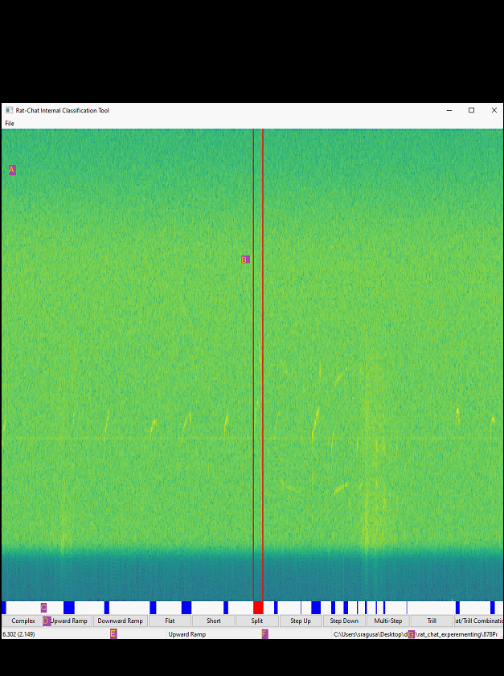

# Raspy Classification Tool Quick-Start Guide

## Tool Anatomy:

id| Name | Explanation
--- | --- | ---
A | Spectrogram | A spectrogram of the data contained in the currently viewed .wav file (see item G)
B | Bounding Lines | The two vertical red lines indicate the boundaries for the segment (in time) currently selected.  It can be specified by clicking, dragging, then releasing the cursor on the spectrogram, or by clicking an existing segment in the Segmenter (item C).
C | Segmenter | A view of the classifications which have been made already.  A segment can be selected by clicking on one of the colored blocks, and a selected segment can be identified by becoming red, and by the bounding lines being moved to the segments boundaries.
D | Call Buttons | Buttons used to classify a selected segment (either selected through the Bounding Lines or the Segmenter)
E | Time Viewer | Shows the time at the location where the cursor (mouse) currently is.  It’s format is as follows: _(time_relative_to_entire_file_start) time_relative_to_viewed_file_start_
F | Classification Viewer | Shows the classification of the call where the mouse currently is (or nothing if not hovering over a classified call)
G | Current File | Displays the .wav file currently being viewed.

## First Use Step-By-Step Guide:
1.	Click on the ‘File’ menu on the top left of the window, then select ‘Open New File’
1.	Select a .wav file to open, then specify the sampling rate.  If the file is large, it will split it into multiple chunks, then load the spectrogram for the first one (will load the entire spectrogram if it’s a small file).
1.	Click on the spectrogram, drag your mouse to the left or right, then release the click.  You should now see two vertical red lines.
1.	Click on the call button labeled ‘Flat’.  You should now see a blue box under the spectrogram (in the Segmenter).  To see what it’s classification is, hover over it (or above it in the spectrogram) and the classification (Flat) should be seen in the center bottom of the window (in the Classification Viewer).
1.	Now select the classification by clicking on the blue box in the Segmenter, then press the delete key to remove it.
1.	Go back to the ‘File’ menu, then select ‘Run Classification’.
1.	After it’s done running, you should see the Segmenter become populated with various call classifications.  Now select one of them (not the first call), by clicking on one of the blue boxes in the Segmenter.
1.	Press the ‘z’ key, which will zoom into the selected call.  
1.	Press Ctrl + left arrow key, which will then zoom in on the previous call.
1.	Zoom out, either by using your mouse’s scroll wheel, or by pressing the up arrow key.
1.	Press the right arrow key to view the next portion of the split .wav file.bode 
1.	Press The X button  to close the window then save your work when prompted.
1.	The classification information (and various other relevant data) can then be found in the same directory as the original .wav file selected, within a folder with the same name as the original selected .wav file

## Hotkey Cheat-Sheet:

Hotkey | What it does
--- | ---
Ctrl + S | Saves the classification data as a CSV (overriding previously saved data)
Scroll Wheel | Zooms into the spectrogram (centered wherever your mouse is located)
Up/Down Arrows | Zooms into the spectrogram (centered at the center of the spectrogram)
Left/Right Arrows | Moves between the files (generated when the initial .wav file is split)
Z | Zooms into the segment/call currently selected
Ctrl + Left/Right Arrows | Zooms into the next or previous segment/call (relative to the call currently selected)
Delete | Removes the classification currently selected

